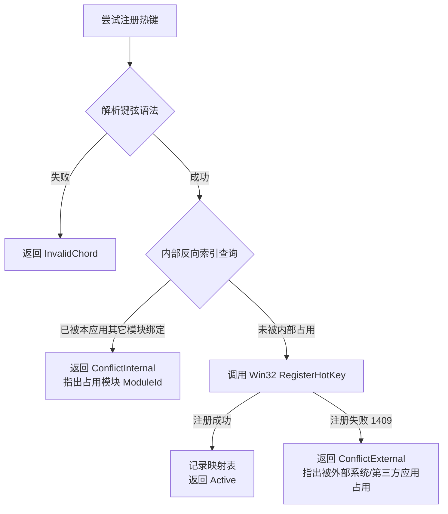

# 全局快捷键管理与冲突检测系统重构方案

> 创建日期：2026-09-18  
> 状态：设计提案（待剪贴板模块实施后排期）  
> 适用范围：`CarroDesk.Host.Services.HotkeyService` 及所有模块快捷键管理

---

## 1. 现状痛点深度剖析

当前 CarroDesk 的快捷键系统（基于 `CarroDesk.Services.Tasks.HotkeyService`）虽然实现了基础的 Windows `RegisterHotKey` 封装，但在多模块架构下存在显著缺陷：

### 1.1 无内部冲突检测（Internal Conflict Blindness）
- **现象**：`HotkeyService` 仅以全局递增整数 `_nextId` 作为 Win32 标识符，其内部映射表为 `Dictionary<int, Action>` 和 `Dictionary<int, string>`。
- **问题**：服务内部**完全没有维护热键键位（`Modifiers + VirtualKey`）到注册者的反向索引**。如果模块 A（如 `Awake`）注册了 `Win+Alt+A`，随后模块 B（如 `AudioSwitch`）在配置中也设成了 `Win+Alt+A`，系统会向同一个句柄再次发起 `RegisterHotKey`，导致 Windows 报错 `1409 (ERROR_HOTKEY_ALREADY_REGISTERED)`。
- **后果**：后注册的模块直接失效，且系统无法明确告诉用户：“该快捷键已被内部模块【防睡眠】占用”。

### 1.2 无法明确区分“内部冲突”与“外部冲突”
- 当前仅返回泛化的字符串 `"RegisterHotKey failed code=1409 (maybe in use)"`。
- 用户和模块调用方无法区分究竟是：
  1. **内部冲突**：CarroDesk 自身的两个模块配置了相同键位；
  2. **外部冲突**：第三方软件（如微信、QQ、PowerToys）或 Windows 系统本身占用了该快捷键；
  3. **格式非法**：如不支持的单键或无效字符。

### 1.3 缺乏统一的快捷键注册表与 CheatSheet 视图
- 各模块各自为政读取自身配置中的 `Hotkey` 并在 `OnStart()` 中注册，没有集中式的只读/读写注册表。
- 宿主和用户无法一览应用当前注册了哪些热键，也无法在设置界面全局统一调整和诊断。

### 1.4 设置修改缺乏“即时预检机制”（Preflight / Dry-Run）
- 用户在模块设置窗口修改快捷键时，只能先保存并期望成功，如果冲突了没有任何界面高亮提示。

---

## 2. 重构目标与核心原则

1. **确定性冲突诊断**：
   - 内部冲突可精确定位到冲突的 `ModuleId` 和具体操作名。
   - 外部冲突可明确给出 Windows Win32 错误原因。
2. **正规化标准键弦（Canonical Key Chords）**：
   - 消除修饰键顺序、大小写和别名差异（如 `Ctrl+Alt+A` 与 `Alt+Control+a` 正规化为同一标准键弦）。
3. **统一热键注册表（Central Hotkey Registry）**：
   - 宿主统一维护全局注册表，任何模块注册/注销实时派发状态事件。
4. **预检与探测支持（Availability Probing）**：
   - 提供无害的热键可用性探测 API，供 UI 输入控件在用户按下键位时实时显示“可用 / 内部冲突 / 外部占用”。
5. **平滑向后兼容**：
   - 保留原 `IHotkeyService.Register` 的常见签名，底层全面升级为新的丰富契约。

---

## 3. 架构设计与核心模型

### 3.1 领域模型设计

```csharp
namespace CarroDesk.Core.Hotkeys
{
    /// <summary>
    /// 热键当前物理/逻辑状态
    /// </summary>
    public enum HotkeyState
    {
        Active,              // 成功注册并激活生效
        Disabled,            // 已配置但被禁用（如模块未启用或配置空）
        ConflictInternal,    // 内部冲突：被 CarroDesk 内部其他模块抢占
        ConflictExternal,    // 外部冲突：被操作系统或其他第三方程序占用
        InvalidChord         // 键位语法不合法（如缺少主按键或非法修饰符）
    }

    /// <summary>
    /// 热键注册条目描述
    /// </summary>
    public class HotkeyBindingInfo
    {
        public string ModuleId { get; set; }          // 所属模块标识符，如 "ScreenLock"
        public string ActionKey { get; set; }         // 模块内动作标识符，如 "ToggleLock"
        public string DisplayName { get; set; }       // 可读说明，如 "切换屏幕锁定"
        public string RawKeyString { get; set; }      // 原始配置字符串，如 "win+alt+L"
        public string NormalizedChord { get; set; }   // 正规化键位，如 "Win+Alt+L"
        public HotkeyState State { get; set; }        // 状态
        public string ConflictTarget { get; set; }    // 内部冲突时记录对方模块名，外部冲突时记录错误说明
    }

    /// <summary>
    /// 预检与探测结果
    /// </summary>
    public class HotkeyProbeResult
    {
        public bool IsAvailable => State == HotkeyState.Active;
        public HotkeyState State { get; set; }
        public string Message { get; set; }
        public string ConflictedModuleId { get; set; }
    }
}
```

### 3.2 服务契约升级（`IHotkeyService`）

```csharp
namespace CarroDesk.Core
{
    public interface IHotkeyService : IDisposable
    {
        // --- 基础注册与注销（兼容现有模块） ---
        int Register(string moduleId, string hotkey, Action callback, out string error);
        void Unregister(int id);
        void UnregisterAll(string moduleId);

        // --- 重构新增：全特性语义化注册 ---
        int Register(string moduleId, string actionKey, string hotkey, string displayName, Action callback, out HotkeyProbeResult result);

        // --- 重构新增：可用性预检（供设置 UI 实时打字校验） ---
        HotkeyProbeResult ProbeAvailability(string hotkey, string forModuleId = null);

        // --- 重构新增：全局快捷键快照（供统一快捷键面板/诊断查看） ---
        IReadOnlyList<HotkeyBindingInfo> GetAllBindings();

        // --- 全局状态变更事件（托盘或设置面板响应联动） ---
        event Action<HotkeyBindingInfo> BindingStateChanged;
    }
}
```

---

## 4. 关键算法与实现机制

### 4.1 键弦正规化（Key Chord Normalization）
统一按固定修饰键顺序重排：`Win` -> `Ctrl` -> `Alt` -> `Shift` + `Key`。
- 输入 `"ctrl + win + A"` -> 正规化为 `"Win+Ctrl+A"`
- 输入 `"control + alt + delete"` -> 正规化为 `"Ctrl+Alt+Delete"`
- 内部索引以计算出的 `uint PackedKey = (uint)modifiers << 16 | (uint)virtualKey` 作为主键，确保 `O(1)` 比对。

### 4.2 两级冲突检测管线（Two-Tier Conflict Detection Pipeline）

当模块或 UI 尝试注册/探测某个快捷键时，执行两级判断：



### 4.3 临时探测窗口（Probing Window）
- 为了在用户修改输入框时实时探测是否被系统/第三方占用，而不影响当前实际注册的快捷键：
  - `ProbeAvailability(hotkey, forModuleId)` 会先检查内部冲突；
  - 若内部无冲突，使用一个临时的隐形消息句柄执行单次 `RegisterHotKey` 测试，若成功则立即 `UnregisterHotKey` 并返回“可用”，若抛出 1409 则判定为“被外部程序占用”。

---

## 5. 统一快捷键管理界面规划（UI / UX）

在全局“设置窗口”中新增【快捷键管理】面板：
1. **全局快捷键总览表格**：
   - 列定义：`所属功能/模块` | `动作名称` | `快捷键` | `运行状态` | `操作`
   - 状态标识：
     - 🟢 **生效中**（正常监听）
     - 🔴 **内部冲突**（提示“与【XX模块】冲突，需调整其中一个”）
     - 🟡 **外部占用**（提示“已被系统或其它软件占用”）
2. **快捷键冲突引导**：
   - 冲突项带有红色高亮边框和修改引导按钮，点击即可直接跳转到对应模块设置项修改。

---

## 6. 实施路线图（排期规划）

*本方案作为剪贴板历史模块实施后的后续重构计划，预计分三个迭代落地：*

- **阶段 1：底层核心重构**
  - 重写 `HotkeyService.cs`，引入 `PackedKey` 内部反向索引字典；
  - 增加内部冲突探测与外部冲突精确分类；
  - 保持现有所有模块的调用代码零破坏向后兼容。
- **阶段 2：预检与探测能力落地**
  - 实现 `ProbeAvailability` 临时句柄探测；
  - 完善单元测试：覆盖键弦正规化、内部冲突拦截、多模块并发注册。
- **阶段 3：设置界面升级**
  - 在宿主设置中引入“快捷键总览与冲突诊断面板”；
  - 模块设置窗口的热键输入框集成实时冲突校验器。
