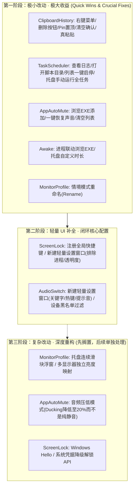

# CarroDesk 各模块功能与操作缺陷深度审查与改进计划

> **生成时间**：2026-09-19  
> **制定原则**：真实功能缺陷驱动，拒绝为加而加；优先实现“改动小、收益大、交互闭环”的必备功能；改动特别大的架构型需求明确标记并暂时搁置；每个模块独立实现、独立验证并独立 commit。

---

## 目录
1. [审查原则与痛点分类](#1-审查原则与痛点分类)
2. [各模块必备功能与操作缺陷详析](#2-各模块必备功能与操作缺陷详析)
   - [2.1 剪切板历史 (ClipboardHistory)](#21-剪切板历史-clipboardhistory)
   - [2.2 屏幕锁定与闲时保护 (ScreenLock)](#22-屏幕锁定与闲时保护-screenlock)
   - [2.3 音频输出设备切换 (AudioSwitch)](#23-音频输出设备切换-audioswitch)
   - [2.4 自动化计划任务 (TaskScheduler)](#24-自动化计划任务-taskscheduler)
   - [2.5 应用前后台智能静音 (AppAutoMute)](#25-应用前后台智能静音-appautomute)
   - [2.6 显示器亮度与情境模式 (MonitorProfile)](#26-显示器亮度与情境模式-monitorprofile)
   - [2.7 保持唤醒 (Awake)](#27-保持唤醒-awake)
3. [按“改动小收益大”的优先级分级与排期](#3-按改动小收益大优先级分级与排期)
4. [执行规划与工程交付标准](#4-执行规划与工程交付标准)

---

## 1. 审查原则与痛点分类

在日常桌面生产力工具的使用中，以下情况属于**真实功能缺陷**：
1. **交互闭环断层（Broken Interaction Flow）**：用户通过鼠标可以浏览列表，却无法通过鼠标执行最基本的 CRUD（如单条删除、重命名）；底层有逻辑但 UI 完全没有暴露入口。
2. **毁灭性误触（Destructive Action without Confirmation）**：高危清空操作点击即生效，没有任何防误触二次确认。
3. **功能文案与实际行为不符（Misleading UX）**：界面承诺“复制并粘贴”，底层实际只完成了“复制”，导致用户误以为粘贴失败。
4. **硬编码配置无 GUI 维护途径（Config Orphan）**：底层依赖复杂的正则表达式或匹配关键字，但整个模块连一个设置弹窗都没有，普通用户只能手动翻 JSON 甚至导致功能完全不可用。
5. **异常与死锁应急缺乏（Lack of Safe Escape Hatch）**：如锁屏无法用快捷键触发、声音误静音后缺少全局一键恢复等。

---

## 2. 各模块必备功能与操作缺陷详析

### 2.1 剪切板历史 (`ClipboardHistory`)

#### 现状与痛点定位
* **当前现状**：支持快捷键唤出、搜索过滤、双击/回车写回剪贴板、键盘 `Delete` 键删除当前选定条目、底部“清空”按钮。
* **核心真实缺陷**：
  1. **单条记录缺少鼠标操作入口（右键菜单 / 悬浮删除按钮）**
     - **现状**：UI 上每一项仅包含文本和时间，鼠标悬浮没有删除按钮，**没有任何右键上下文菜单（ContextMenu）**。纯鼠标操作的用户完全无法删除敏感信息（如刚复制的密码、私钥、个人手机号等），甚至根本不知道可以按键盘 `Delete`。
     - **必备补齐**：为列表项添加右键菜单（复制、仅复制不关闭、删除、置顶固定），并在条目右侧提供鼠标悬浮时显隐的快速删除 `✕` 按钮。
  2. **缺少“固定/置顶 (Pin)”机制**
     - **现状**：数据模型 `ClipboardItem` 缺少 `IsPinned` 属性。随着复制次数增多，常用文本段落会被无差别顶出历史记录（达到 `MaxItems` 限制时 FIFO 剔除）；且点击一键清空时也会被一并删除。
     - **必备补齐**：模型与存储增加 `IsPinned` 字段；置顶项始终显示在列表最顶端并带有图钉图标；清空历史记录时默认保留固定项。
  3. **“清空”操作没有任何防误触二次确认**
     - **现状**：无论是托盘右键菜单中的“清空历史记录”，还是窗口右下角的“清空”按钮，点击后立即无条件抹杀全部历史记录，极易手滑误触。
     - **必备补齐**：弹出标准确认框：“确定要清空所有未固定的剪贴板记录吗？此操作不可恢复。”
  4. **“双击或 Enter 复制并粘贴”文案与实际代码脱节**
     - **现状**：界面底部文案明确承诺“双击或 Enter 复制并粘贴”，但实际代码 `CommitSelectedItem` 仅执行了写回剪贴板并隐藏窗口，**根本没有发送模拟粘贴键（Ctrl+V）**。用户双击后原应用无任何输入，体验产生严重脱节。
     - **必备补齐**：在隐藏浮窗并恢复前台焦点后，通过 `keybd_event` 或 `SendInput` 真实模拟 `Ctrl+V`；或在配置中明确区分“复制并粘贴”与“仅复制”。
  5. **长文本查看详情缺失**
     - **现状**：单行文本超出后字符截断，Tooltip 在面对数百行长文本或复杂代码时难以完整查看或局部选择复制。
     - **必备补齐**：右键菜单增加“查看完整内容”弹窗。

---

### 2.2 屏幕锁定与闲时保护 (`ScreenLock`)

#### 现状与痛点定位
* **当前现状**：支持系统空闲自动锁屏、托盘手动“立即锁定”、大时钟日期显示、PIN 验证与键盘钩子防御、多显示器遮罩。
* **核心真实缺陷**：
  1. **完全缺失全局锁屏快捷键（Global Hotkey to Lock）**
     - **现状**：托盘菜单注明 `InputGestureText = "Win+L (仿真)"`，但 Windows 内核独占了 `Win+L`，第三方应用无法注册也无法拦截。模块代码中压根没有引入 `IHotkeyService`，导致用户完全无法用键盘一键锁屏，必须用鼠标去托盘二级菜单点击。
     - **必备补齐**：引入全局热键服务，支持可自定义热键（如 `Ctrl+Alt+L` 或 `Ctrl+Win+L`）一键立即锁定。
  2. **完全缺失配置界面（No Settings UI）**
     - **现状**：`ScreenLockConfig` 支持 `ExcludeProcesses`（白名单进程，如游戏、播放器运行时不自动锁屏）、`OverlayOpacity`（背景透明度）、`ShowClock`（时钟显示）等高级参数，但整个模块除了托盘几个固定时间档位外，**没有任何设置界面**可配置这些参数。
     - **必备补齐**：新增轻量级设置对话框 `ScreenLockSettingsWindow`，支持配置全局热键、排除程序白名单（支持浏览 EXE 与当前运行进程选取）、遮罩透明度滑块。
  3. **锁定状态下防死锁保护缺失**
     - **现状**：如果用户输入法卡死、PIN 码遗忘，键盘全局被钩子屏蔽且窗口强制 TOPMOST，缺乏逃生通道。
     - **必备补齐**：在锁屏界面增加“切换至 Windows 登录锁屏”应急按钮（调用 `LockWorkStation`），确保绝对不会死锁。
  4. **暂停计时缺少自定义时长**
     - **现状**：托盘子菜单仅死板地提供了“暂停 30 分钟”和“暂停 1 小时”，无法暂停至今天下班或自定义分钟数。

---

### 2.3 音频输出设备切换 (`AudioSwitch`)

#### 现状与痛点定位
* **当前现状**：托盘菜单列出全部输出端点，勾选默认设备；快捷键在扬声器与耳机之间轮询切换。
* **核心真实缺陷**：
  1. **完全缺失图形设置界面（No Settings UI）**
     - **现状**：配置中存在 `SpeakerPattern`（默认“扬声器”）、`HeadphonePattern`（默认“耳机”）、`Hotkey`、`PlayNotificationSound`，但**整个模块连一个设置窗口或入口都没有**。若用户的耳机设备名为“Sony WH-1000XM5”或“AirPods”，智能切换逻辑直接失效，普通用户完全不知道如何修改。
     - **必备补齐**：新增 `AudioSwitchSettingsWindow`，提供设备智能匹配关键字选择、快捷键配置与提示音开关。
  2. **设备排除黑名单缺失（快捷键误切到无效设备）**
     - **现状**：现代台式机显卡通常带有 3~4 个 NVIDIA High Definition Audio 显示器音频口。快捷键在按模式未命中时会循环切换至这些无效设备，造成“切换后突然静音”的严重问题。
     - **必备补齐**：允许用户在设置中勾选排除特定设备，被排除设备不参与快捷键轮询。
  3. **未联动“默认通信设备”**
     - **现状**：Windows 系统区分“默认多媒体设备”与“默认通信设备”。当前代码只设置了回放设备，用户切到耳机后，开会软件（微信、会议软件）仍从音箱外放。
     - **必备补齐**：支持切换时同步设为默认通信设备。

---

### 2.4 自动化计划任务 (`TaskScheduler`)

#### 现状与痛点定位
* **当前现状**：支持多种触发器、表单编辑、测试运行、参数模板、文件选择。
* **核心真实缺陷**：
  1. **任务列表无法一键快速启用/停用（Toggle Enabled 缺失）**
     - **现状**：左侧列表中每个条目只有一个状态小圆点，没有开关复选框。用户若想临时停用某个定时任务，必须：点击选中该任务 -> 移动视线到右侧表单找到“启用”勾选框 -> 取消勾选 -> 视线移到底部点击“保存并生效”。
     - **必备补齐**：在左侧任务列表的条目中直接集成 CheckBox 或 Switch，点击直接切换启用状态并自动存盘更新。
  2. **完全缺失查看任务执行日志（View Logs）的直接入口**
     - **现状**：表单提示“生成日志保存在 logs/task-{name}.log”，但整个任务编辑器和托盘中**没有任何一个按钮可以打开该任务的日志**。任务测试失败或运行异常时，用户完全看不到详细报错。
     - **必备补齐**：在右侧表单、测试结果框以及任务右键菜单中增加“查看执行日志”按钮（一键用系统默认记事本打开对应该任务的 log 文件）和“打开日志目录”。
  3. **缺少“打开脚本目录（Open scripts/ Folder）”快捷按钮**
     - **现状**：用户编写新脚本时，界面只有下拉选择，无法快速定位并打开本地实际的 `scripts/` 目录。
     - **必备补齐**：在脚本选择区域旁增加“打开 scripts 目录”按钮。
  4. **托盘“手动运行”无法执行非 manual 类型的定时任务**
     - **现状**：托盘菜单的“手动运行”子菜单只列出了 TriggerType 为 `Manual` 的任务。如果用户配置了一个 `daily`（每天晚上 23:00 备份）或 `cron` 任务，临时想要**立即手动执行一次**，托盘完全做不到。
     - **必备补齐**：托盘手动运行菜单允许执行所有当前已启用的任务，或提供“立即执行全部任务列表”的入口。

---

### 2.5 应用前后台智能静音 (`AppAutoMute`)

#### 现状与痛点定位
* **当前现状**：支持黑/白名单、切后台延迟静音、切前台恢复；可在设置页从当前运行/发声应用下拉框选取，或手动输入进程名。
* **核心真实缺陷**：
  1. **缺少“浏览选择可执行文件 (.exe)”操作**
     - **现状**：当前只能从运行中列表选或手动手敲。对于当前尚未运行的程序（如大型游戏、渲染软件），用户无法通过常规的“浏览...”按钮在资源管理器中选中 `.exe` 自动填入进程名。
     - **必备补齐**：在“手动输入进程名”旁增加“浏览可执行文件 (.exe)...”按钮，文件选取后自动提取进程文件名。
  2. **缺少“一键解除所有静音 / 恢复所有声音”紧急操作**
     - **现状**：前台识别偶尔偶发异常或程序崩溃卡死可能导致后台软件误静音，托盘和界面上没有显式的一键解静音按钮。
     - **必备补齐**：托盘菜单及设置界面增加“一键恢复所有声音（Unmute All）”按钮，即时调用底层 `UnmuteProcesses`。
  3. **受控程序列表缺少“清空”操作**
     - **现状**：只能单条点击“移除”，若配置过多清理繁琐。
     - **必备补齐**：增加“清空列表”功能。
  4. **托盘快捷操作断层：无法一键添加当前前台应用**
     - **现状**：切换至某应用想立刻加入后台静音，必须大费周章打开设置窗口再找或敲。
     - **必备补齐**：托盘菜单增加“将当前活动窗口应用加入静音列表”极速入口。

---

### 2.6 显示器亮度与情境模式 (`MonitorProfile`)

#### 现状与痛点定位
* **当前现状**：DDC/CI & WMI 调节、情境模式（日常、游戏、夜间）、分时间段自动调节计划、快捷键微调。
* **核心真实缺陷**：
  1. **情境模式无法重命名（Rename 缺失）**
     - **现状**：设置窗口可点击“新建...”，生成 `Custom1`, `Custom2`，但界面上**根本没有重命名按钮，双击也无法编辑文本**。用户无法将其命名为“阅读模式”、“观影”等。
     - **必备补齐**：添加“重命名...”按钮或双击模式名称就地编辑支持。
  2. **时间段列表无法直接编辑已有参数**
     - **现状**：DataGrid 中的时间点如果要微调亮度，无法直接行内编辑，下方只有新增。用户必须先删除旧项，再在下方重新输入一遍然后添加。
     - **必备补齐**：开放 DataGrid 行内编辑或双击载入到底部编辑栏修改。
  3. **托盘菜单缺少连续调节滑块（Slider）**
     - **现状**：托盘只有 +5% / -5% 和跳跃的 4 个预设档位，调节体验断续。

---

### 2.7 保持唤醒 (`Awake`)

#### 现状与痛点定位
* **当前现状**：支持被动、无限期、定时、指定时刻；进程联动；电池策略；常亮开关；托盘功能丰富。
* **核心真实缺陷**：
  1. **进程联动列表缺少“浏览可执行文件”**
     - **现状**：设置窗口只有下拉选运行中进程或手敲，未运行的程序无法浏览 EXE 添加。
     - **必备补齐**：增加“浏览 EXE 文件...”按钮。
  2. **临时保持唤醒 vs 启动默认配置混淆**
     - **现状**：用户在托盘临时点击一次“无限期保持唤醒”，配置立即存盘。下次重启电脑后仍然保持无限期唤醒，破坏了开机默认被动计划的预期。
     - **必备补齐**：托盘快速切换区分“本次临时保持”与“设为默认常驻策略”。
  3. **托盘菜单缺少自定义时长快捷入口**
     - **现状**：托盘只有预设时长，想定时 45 分钟必须打开设置窗口。
     - **必备补齐**：托盘定时子菜单增加“自定义分钟数...”输入项。

---

## 3. 按“改动小收益大”的优先级分级与排期

基于**开发风险可控、代码侵入性小、解决真实高频痛点**的原则，进行阶梯式排序：

### 优先级清单详细说明

| 批次 | 模块 | 核心工作项 | 改动规模 | 预估收益 |
| :--- | :--- | :--- | :--- | :--- |
| **P0-1** | **ClipboardHistory** | ① 列表项右键菜单（单条删除、仅复制、复制并粘贴、Pin置顶） ② 悬浮快速删除按钮 ③ Model/Storage 增加 `IsPinned` 支持 ④ 清空操作增加二次确认弹窗 ⑤ 真实模拟 Ctrl+V 自动粘贴到前台应用 | 小（约 150 行） | **极高**（彻底解决剪切板单条删除与置顶刚需） |
| **P0-2** | **TaskScheduler** | ① 任务编辑器与右键菜单增加“查看任务日志”按钮（Notepad打开） ② 增加“打开脚本目录（scripts/）”快捷按钮 ③ 任务列表增加 CheckBox 实现一键快捷启停 ④ 托盘手动运行支持全部已启用的计划任务 | 小（约 120 行） | **极高**（彻底打通任务排错、脚本投放与临时触发闭环） |
| **P0-3** | **AppAutoMute** | ① 增加“浏览可执行文件 (.exe)”选取进程名 ② 托盘与设置页增加“一键恢复所有声音（Unmute All）” ③ 增加“清空受控程序列表” | 小（约 80 行） | **高**（解决配置未运行程序难、误静音后无处恢复痛点） |
| **P0-4** | **MonitorProfile** | ① 模式列表增加“重命名（Rename）”功能 ② 时间段列表支持就地载入编辑修改 | 小（约 60 行） | **高**（终结新建情境模式只能叫 Custom1 的尴尬） |
| **P0-5** | **Awake** | ① 进程联动支持“浏览 EXE 文件”选取 ② 托盘增加自定义定时时长输入 | 小（约 60 行） | **中高**（提升便携配置体验） |
| **P1-1** | **ScreenLock** | ① 注册全局锁屏快捷键（默认 `Ctrl+Alt+L`） ② 新建轻量级设置窗口 `ScreenLockSettingsWindow`（配置白名单进程、遮罩透明度等） ③ 锁定界面增加“Windows 锁屏”安全逃生通道 | 中（新增1个Window） | **极高**（补齐无热键与无设置界面的严重短板） |
| **P1-2** | **AudioSwitch** | ① 新建轻量级设置窗口 `AudioSwitchSettingsWindow`（配置扬声器/耳机关键字、切换热键） ② 增加设备排除黑名单（解决切到无声显示器 HDMI 的缺陷） ③ 同步切换默认通信设备开关 | 中（新增1个Window） | **极高**（补齐完全没有设置界面的严重短板） |
| **搁置** | **MonitorProfile** | 托盘独立平滑滑块浮窗、多显示器差异化亮度控制 | 大（涉及硬件底层与无边框浮层） | 后续单独立项重构 |
| **搁置** | **AppAutoMute** | 音量压低模式（Ducking 降至 20% 音量而不是彻底静音） | 大（涉及 WASAPI 音频会话音量精确控制与淡入淡出） | 后续单独立项重构 |

---

## 4. 执行规划与工程交付标准

1. **单模块独立推进**：
   - 严格按照 **ClipboardHistory -> TaskScheduler -> AppAutoMute -> MonitorProfile -> Awake -> ScreenLock -> AudioSwitch** 顺序推进。
2. **独立 Git Commit**：
   - 严禁多个模块混杂提交。每个模块改动完成后，通过单元测试与编译检查，单独生成英文规范 commit message（如 `feat(clipboard): add context menu, single item deletion, and pin support`）。
3. **UI 与端到端 (E2E) 验证**：
   - 涉及 WPF XAML 界面改动的，严格保障样式一致性（遵循设计规范：卡片圆角 6~8px、主题色 `#1A73E8`、无外突或悬空滚动条、DPI 自适应）。
   - 保证所有交互在无数据、长文本、极端边界情况下均不错乱。
4. **日志与安全追溯**：
   - 重要代码改动必须在 `docs/CHANGES-YYYYMMDD.md` 顶部记录真实时间与变更摘要。
   - 编辑前针对未提交内容严格遵守“备份先行”准则。
