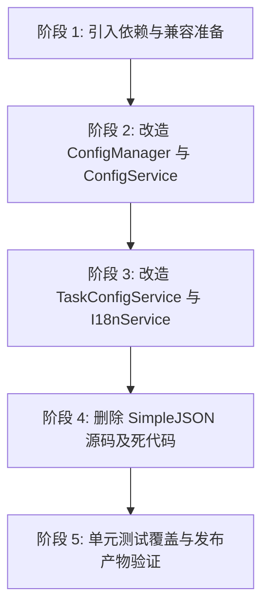

# CarroDesk 引入 Newtonsoft.Json 迁移与重构实施方案

> **文档状态**：方案拟定 / 待评审  
> **制定时间**：2026-09-17  
> **目标框架**：.NET Framework 4.8 (`net48`) / C# 7.3  
> **主要变更**：移除手写 SimpleJSON 源码库及手工拼接序列化，引入 `Newtonsoft.Json` (13.0.3) 统一接管全局 JSON 读写  

---

## 1. 背景与重构目标

### 1.1 现状缺陷剖析
经过对当前项目源码的全面审查，目前 JSON 读写方式存在严重的技术债务与隐患：

1. **石器时代的手工逐字段搬砖**：
   - [`ConfigService.cs`](file:///c:/Home/Projects/CarroDesk/src/Services/ConfigService.cs#L248-L275) 与 [`TaskConfigService.cs`](file:///c:/Home/Projects/CarroDesk/src/Services/Tasks/TaskConfigService.cs#L129-L158) 目前使用 `StringBuilder` 纯手工拼接 JSON 字符串（如 `sb.AppendLine("  \"IdleMinutes\": " + Current.IdleMinutes + ",");`）。
   - [`ConfigManager.cs`](file:///c:/Home/Projects/CarroDesk/src/Host/Services/ConfigManager.cs#L111-L355) 针对 `AudioSwitch`、`AppAutoMute`、`MonitorProfile` 三个模块手写了超过 200 行的逐字段提取与组装代码，一旦模型增减字段，必须在序列化与反序列化两端多处同步改动，极其容易遗漏。
2. **字符转义严重缺失，存在数据损坏隐患**：
   - 当前写 JSON 的转义函数仅为 `value.Replace("\\", "\\\\").Replace("\"", "\\\"")`。对换行符（`\r`, `\n`）、制表符（`\t`）、不可见控制字符毫无防护。用户输入若含换行符或特殊字符，写入后的 JSON 将直接损坏且无法还原。
3. **冗余外部源码与重复造轮子**：
   - 依赖的外部源码 [`src/Extras/SimpleJSON/`](file:///c:/Home/Projects/CarroDesk/src/Extras/SimpleJSON/) 占用近 90KB，其中甚至包含针对 Unity 引擎的扩展（`Vector2`, `Matrix4x4`, `Quaternion`），与本项目纯 WPF/.NET 4.8 环境完全不相符。
   - `ConfigService.cs` 底部内嵌了一个手写的 `SimpleJson` 词法解析类；`TaskConfigService.cs` 内部又手写了一套剥除注释的状态机与 `ParseObject`。项目中同时存在三套 JSON 解析机制回退打架。
4. **注释处理脆弱**：
   - `config.sample.json` 和 `tasks.sample.json` 包含大量的 `//` 注释供用户参考，当前用手写正则与字符串替换剥离注释，容易误伤字符串内容中的 `//`。

### 1.2 重构目标
- **零破坏向后兼容**：现有用户的 `config.json` 与 `tasks.json` 100% 无缝读取，现有配置不丢失。
- **高健壮性与标准性**：通过工业级成熟库实现标准 RFC 规范的转义、格式化缩进排版（`Formatting.Indented`）。
- **极简代码库**：彻底删除 `src/Extras/SimpleJSON/` 整个目录及手写解析器，净减数百行维护成本极高的样板代码。
- **天然支持注释**：安全读取包含 `//` 和 `/* */` 注释的 JSON 配置文件。
- **单文件无缝打包**：与现有的 `Costura.Fody` 完美集成，零额外传递依赖，零程序集版本冲突。

---

## 2. 技术选型与依据

### 2.1 为什么选择 `Newtonsoft.Json` (13.0.3)？
- **零传递依赖（Zero Transitive Dependencies）**：在 `.NET Framework 4.8` 目标下，`Newtonsoft.Json` 作为一个单 DLL 提供，无需引入任何 `System.Buffers`、`System.Memory`、`System.Runtime.CompilerServices.Unsafe` 等现代 BCL shim 包。
- **Costura.Fody 极度友好**：单 DLL 很容易被 Costura 内嵌打包进主程序 `CarroDesk.exe`，压缩后体积仅增加约 250~300KB，完全避免了在 net48 下引入 System.Text.Json 常遇到的程序集绑定重定向（bindingRedirect）与 TypeLoadException 风险。
- **原生支持注释读取**：`Newtonsoft.Json` 的 `JsonTextReader` 默认宽容接受 `//` 和 `/* */` 注释，无需前置正则剥离。
- **极其宽容的容错与转换能力**：支持缺失字段忽略、空值处理、大小写不敏感匹配，非常适合常被用户手工修改的本地桌面配置文件。

---

## 3. 详细实施方案与代码改造设计

### 3.1 模块 1：项目工程依赖引入与清理
#### [MODIFY] [`src/CarroDesk.csproj`](file:///c:/Home/Projects/CarroDesk/src/CarroDesk.csproj)
在 `<ItemGroup>` 的 PackageReference 中引入官方稳定版：
```xml
<ItemGroup>
  <PackageReference Include="Hardcodet.NotifyIcon.Wpf" Version="2.0.1" />
  <PackageReference Include="Newtonsoft.Json" Version="13.0.3" />
  <PackageReference Include="Costura.Fody" Version="6.0.0" PrivateAssets="all" />
  <PackageReference Include="Fody" Version="6.9.2" PrivateAssets="all" />
</ItemGroup>
```

#### [DELETE] 删除冗余源码
直接删除整个目录：
- `src/Extras/SimpleJSON/SimpleJSON.cs`
- `src/Extras/SimpleJSON/SimpleJSONBinary.cs`
- `src/Extras/SimpleJSON/SimpleJSONDotNetTypes.cs`
- `src/Extras/SimpleJSON/SimpleJSONUnity.cs`

---

### 3.2 模块 2：`ConfigService.cs` 改造

#### 兼容性需求与设计：
1. **`ExcludeProcesses` 兼容性**：用户在配置文件中可能写成数组 `["a.exe", "b.exe"]`，也可能写成逗号分隔字符串 `"a.exe, b.exe"`。需编写通用的 `StringOrStringListConverter`，实现两种格式的自适应读取。
2. **模块专属配置字符串**（`AudioSwitchJson`、`AppAutoMuteJson`、`MonitorProfileJson`）：
   - 在 `config.json` 中，原先作为根级属性以转义字符串形式存储：
     ```json
     {
       "IdleMinutes": 5,
       "AudioSwitch": "{\"Enabled\":true,\"Hotkey\":\"Ctrl+`\"}",
       ...
     }
     ```
   - 保持属性名和格式完全一致，既可兼容老版本，又可自由序列化。
3. **容错机制**：反序列化使用 `JsonSerializerSettings`，设置 `MissingMemberHandling = MissingMemberHandling.Ignore`、`NullValueHandling = NullValueHandling.Ignore`。

#### 核心实现代码设计：
```csharp
// 1. 自适应 StringOrStringListConverter（支持数组或逗号隔开字符串）
public class StringOrStringListConverter : JsonConverter
{
    public override bool CanConvert(Type objectType) => objectType == typeof(List<string>);

    public override object ReadJson(JsonReader reader, Type objectType, object existingValue, JsonSerializer serializer)
    {
        var list = new List<string>();
        if (reader.TokenType == JsonToken.StartArray)
        {
            var arr = JArray.Load(reader);
            foreach (var item in arr)
            {
                var s = item?.ToString()?.Trim();
                if (!string.IsNullOrEmpty(s)) list.Add(s);
            }
        }
        else if (reader.TokenType == JsonToken.String)
        {
            var val = reader.Value?.ToString();
            if (!string.IsNullOrWhiteSpace(val))
            {
                var parts = val.Split(new[] { ',', ';' }, StringSplitOptions.RemoveEmptyEntries);
                foreach (var p in parts)
                {
                    var t = p.Trim();
                    if (!string.IsNullOrEmpty(t)) list.Add(t);
                }
            }
        }
        return list;
    }

    public override void WriteJson(JsonWriter writer, object value, JsonSerializer serializer)
    {
        serializer.Serialize(writer, value);
    }
}
```

#### `ConfigService` 读写核心逻辑简化：
```csharp
// 统一 JSON 序列化设置
private static readonly JsonSerializerSettings JsonSettings = new JsonSerializerSettings
{
    Formatting = Formatting.Indented,
    NullValueHandling = NullValueHandling.Ignore,
    MissingMemberHandling = MissingMemberHandling.Ignore
};

private AppSettings ReadFile()
{
    try
    {
        var json = File.ReadAllText(FilePath, Encoding.UTF8);
        using (var sr = new StringReader(json))
        using (var reader = new JsonTextReader(sr))
        {
            var jObj = JObject.Load(reader);
            var settings = jObj.ToObject<AppSettings>(JsonSerializer.Create(JsonSettings)) ?? new AppSettings();

            // 模块 JSON 字符串槽提取
            this.AudioSwitchJson = jObj["AudioSwitch"]?.ToString() ?? "";
            this.AppAutoMuteJson = jObj["AppAutoMute"]?.ToString() ?? "";
            this.MonitorProfileJson = jObj["MonitorProfile"]?.ToString() ?? "";

            return AppSettings.Merge(settings);
        }
    }
    catch (Exception ex)
    {
        // 若读取异常，优雅回退到默认设置
        return new AppSettings();
    }
}

public void Save()
{
    if (!Directory.Exists(DirPath)) Directory.CreateDirectory(DirPath);
    if (Current == null) Current = new AppSettings();

    // 基于 Current 生成 JObject，并补全模块 JSON 字符串槽
    var jObj = JObject.FromObject(Current, JsonSerializer.Create(JsonSettings));
    jObj["AudioSwitch"] = this.AudioSwitchJson ?? "";
    jObj["AppAutoMute"] = this.AppAutoMuteJson ?? "";
    jObj["MonitorProfile"] = this.MonitorProfileJson ?? "";

    var json = jObj.ToString(Formatting.Indented);
    File.WriteAllText(FilePath, json, Encoding.UTF8);
}
```
> **代码清理**：彻底删除原 `ConfigService.cs` 内部的 `ReadFileLegacy`、`Escape`、`SerializeStringArray`、`ExtractStringArray` 以及底部的全部 `SimpleJson` 类。

---

### 3.3 模块 3：`ConfigManager.cs` 模块配置序列化重构

在 [`ConfigManager.cs`](file:///c:/Home/Projects/CarroDesk/src/Host/Services/ConfigManager.cs) 中，原有 200 多行手写代码全部用泛型/标准序列化替换：

```csharp
public T GetModuleConfig<T>(string moduleId) where T : class, new()
{
    // ScreenLock 与 TaskScheduler 映射不变（直接映射至 Underlying.Current）
    if (string.Equals(moduleId, "ScreenLock", StringComparison.OrdinalIgnoreCase))
    {
        if (typeof(T) == typeof(Modules.ScreenLock.Models.ScreenLockConfig))
        {
            return new Modules.ScreenLock.Models.ScreenLockConfig
            {
                IdleMinutes = _underlying.Current.IdleMinutes,
                PinHash = _underlying.Current.PinHash,
                PinSalt = _underlying.Current.PinSalt,
                ShowClock = _underlying.Current.ShowClock,
                OverlayOpacity = _underlying.Current.OverlayOpacity,
                ExcludeProcesses = _underlying.Current.ExcludeProcesses,
                UnlockOnResume = _underlying.Current.UnlockOnResume,
                Enabled = true
            } as T;
        }
    }
    else if (string.Equals(moduleId, "TaskScheduler", StringComparison.OrdinalIgnoreCase))
    {
        if (typeof(T) == typeof(Modules.TaskScheduler.Models.TaskSchedulerConfig))
        {
            return new Modules.TaskScheduler.Models.TaskSchedulerConfig
            {
                GlobalEnabled = _underlying.Current.TasksEnabled,
                TasksFile = ConfigService.TaskFilePath
            } as T;
        }
    }
    else if (string.Equals(moduleId, "AudioSwitch", StringComparison.OrdinalIgnoreCase))
    {
        if (typeof(T) == typeof(Modules.AudioSwitch.Models.AudioSwitchConfig))
        {
            return DeserializeOrDefault<Modules.AudioSwitch.Models.AudioSwitchConfig>(_underlying.AudioSwitchJson) as T;
        }
    }
    else if (string.Equals(moduleId, "AppAutoMute", StringComparison.OrdinalIgnoreCase))
    {
        if (typeof(T) == typeof(Modules.AppAutoMute.Models.AppAutoMuteConfig))
        {
            return DeserializeOrDefault<Modules.AppAutoMute.Models.AppAutoMuteConfig>(_underlying.AppAutoMuteJson) as T;
        }
    }
    else if (string.Equals(moduleId, "MonitorProfile", StringComparison.OrdinalIgnoreCase))
    {
        if (typeof(T) == typeof(Modules.MonitorProfile.Models.MonitorProfileConfig))
        {
            return (string.IsNullOrWhiteSpace(_underlying.MonitorProfileJson)
                ? Modules.MonitorProfile.Models.MonitorProfileConfig.CreateDefault()
                : DeserializeOrDefault<Modules.MonitorProfile.Models.MonitorProfileConfig>(_underlying.MonitorProfileJson, Modules.MonitorProfile.Models.MonitorProfileConfig.CreateDefault)) as T;
        }
    }

    return new T();
}

public void SaveModuleConfig<T>(string moduleId, T config) where T : class
{
    if (string.Equals(moduleId, "ScreenLock", StringComparison.OrdinalIgnoreCase))
    {
        if (config is Modules.ScreenLock.Models.ScreenLockConfig slc)
        {
            _underlying.Current.IdleMinutes = slc.IdleMinutes;
            _underlying.Current.PinHash = slc.PinHash;
            _underlying.Current.PinSalt = slc.PinSalt;
            _underlying.Current.ShowClock = slc.ShowClock;
            _underlying.Current.OverlayOpacity = slc.OverlayOpacity;
            _underlying.Current.ExcludeProcesses = slc.ExcludeProcesses;
            _underlying.Current.UnlockOnResume = slc.UnlockOnResume;
            _underlying.Save();
        }
    }
    else if (string.Equals(moduleId, "TaskScheduler", StringComparison.OrdinalIgnoreCase))
    {
        if (config is Modules.TaskScheduler.Models.TaskSchedulerConfig tsc)
        {
            _underlying.Current.TasksEnabled = tsc.GlobalEnabled;
            _underlying.Save();
        }
    }
    else if (string.Equals(moduleId, "AudioSwitch", StringComparison.OrdinalIgnoreCase))
    {
        _underlying.AudioSwitchJson = JsonConvert.SerializeObject(config);
        _underlying.Save();
    }
    else if (string.Equals(moduleId, "AppAutoMute", StringComparison.OrdinalIgnoreCase))
    {
        _underlying.AppAutoMuteJson = JsonConvert.SerializeObject(config);
        _underlying.Save();
    }
    else if (string.Equals(moduleId, "MonitorProfile", StringComparison.OrdinalIgnoreCase))
    {
        _underlying.MonitorProfileJson = JsonConvert.SerializeObject(config);
        _underlying.Save();
    }
}

private static T DeserializeOrDefault<T>(string json, Func<T> defaultFactory = null) where T : class, new()
{
    if (string.IsNullOrWhiteSpace(json)) return defaultFactory != null ? defaultFactory() : new T();
    try
    {
        return JsonConvert.DeserializeObject<T>(json) ?? (defaultFactory != null ? defaultFactory() : new T());
    }
    catch
    {
        return defaultFactory != null ? defaultFactory() : new T();
    }
}
```
> **收益**：`SerializeAudioSwitch`、`DeserializeAudioSwitch`、`SerializeAppAutoMute`、`DeserializeAppAutoMute`、`SerializeMonitorProfile`、`DeserializeMonitorProfile` **全部删除**，代码量缩减 70%，健壮性大幅提升。

---

### 3.4 模块 4：`TaskConfigService.cs` 改造

#### 关键兼容点：
1. **注释支持**：`tasks.json` 用户经常手写注释。使用 `new JsonTextReader(new StringReader(json))` 原生支持 `//` 注释与 `/* */` 注释。
2. **多形态根节点兼容**：
   - 格式 A（标准数组）：`[ { "name": "..." }, ... ]`
   - 格式 B（包装对象）：`{ "tasks": [ { "name": "..." } ] }`
   - 格式 C（单任务对象）：`{ "name": "..." }`
3. **字段别名宽容解析**：
   - `trigger`: 可以是字符串（如 `"startup"`），也可以是对象；
   - `trigger.delay` / `delaySec`；`trigger.every` / `everySec` / `intervalSec`；`trigger.at` / `time`；`trigger.expr` / `cron`；`trigger.watchPath` / `path` / `dir`；
   - `action.file` / `path` / `command`；`action.args` / `arguments`；`action.workDir` / `workingDirectory` / `cwd`；
   - `options.timeout` / `timeoutSec`；`options.concurrent` / `allowConcurrent`。

#### 核心改造设计：
```csharp
public static void Save(List<TaskDefinition> tasks)
{
    if (tasks == null) tasks = new List<TaskDefinition>();
    var dir = ConfigService.DirPath;
    if (!Directory.Exists(dir)) Directory.CreateDirectory(dir);

    // 标准格式化输出，整齐缩进
    var json = JsonConvert.SerializeObject(tasks, Formatting.Indented);
    File.WriteAllText(FilePath, json, Encoding.UTF8);
}

private static List<TaskDefinition> ParseTasksJson(string json, List<string> errors)
{
    var list = new List<TaskDefinition>();
    if (string.IsNullOrWhiteSpace(json)) return list;

    try
    {
        using (var sr = new StringReader(json))
        using (var reader = new JsonTextReader(sr))
        {
            var token = JToken.Load(reader);
            if (token is JArray arr)
            {
                foreach (var item in arr)
                {
                    if (item is JObject obj) list.Add(ParseTaskNode(obj, errors));
                    else errors.Add("tasks array item not an object");
                }
            }
            else if (token is JObject obj)
            {
                if (obj["tasks"] is JArray subArr)
                {
                    foreach (var item in subArr)
                    {
                        if (item is JObject taskObj) list.Add(ParseTaskNode(taskObj, errors));
                        else errors.Add("tasks array item not an object");
                    }
                }
                else if (obj["name"] != null)
                {
                    list.Add(ParseTaskNode(obj, errors));
                }
            }
            else
            {
                errors.Add("tasks.json must be array or object");
            }
        }
    }
    catch (Exception ex)
    {
        errors.Add("parse error: " + ex.Message);
    }
    return list;
}
```
在 `ParseTaskNode` 中，利用 `JObject` 的索引器结合 null 合并与辅助方法读取别名属性（如 `obj["file"] ?? obj["path"] ?? obj["command"]`），语法极其清晰直观。
> **代码清理**：彻底删除 `StripComments` 正则替换、`ParseObject`、`ParseArray`、`SkipWs` 等手写词法解析器。

---

### 3.5 模块 5：`I18nService.cs` 改造

在 [`I18nService.cs`](file:///c:/Home/Projects/CarroDesk/src/Services/Localization/I18nService.cs#L170-L216) 中，利用 `JObject` 递归打平多层 JSON：

```csharp
private void ParseAndRegisterLocale(string json)
{
    if (string.IsNullOrWhiteSpace(json)) return;

    try
    {
        var obj = JObject.Parse(json);
        var meta = obj["_meta"] as JObject;
        string code = meta?["code"]?.ToString() ?? "";
        string dispName = meta?["name"]?.ToString() ?? "";

        if (string.IsNullOrEmpty(code)) return;
        if (string.IsNullOrEmpty(dispName)) dispName = code;

        if (!_locales.TryGetValue(code, out var dict))
        {
            dict = new Dictionary<string, string>(StringComparer.OrdinalIgnoreCase);
            _locales[code] = dict;
        }
        _languageNames[code] = dispName;

        FlattenJson(obj, "", dict);
    }
    catch { }
}

private void FlattenJson(JObject obj, string prefix, Dictionary<string, string> target)
{
    foreach (var prop in obj.Properties())
    {
        if (string.Equals(prop.Name, "_meta", StringComparison.OrdinalIgnoreCase)) continue;

        string fullKey = string.IsNullOrEmpty(prefix) ? prop.Name : prefix + "." + prop.Name;
        if (prop.Value is JObject childObj)
        {
            FlattenJson(childObj, fullKey, target);
        }
        else if (prop.Value != null)
        {
            target[fullKey] = prop.Value.ToString();
        }
    }
}
```
> **收益**：删除了全部 `SimpleJSON` 类型依赖，逻辑从 50 行收缩至 25 行，性能与容错性大幅提高。

---

## 4. 实施路线图（Step-by-Step）

为保证实施过程平稳可控，建议分为 5 个阶段逐步推进：



### 阶段 1：引入依赖与兼容准备
- 编辑 `src/CarroDesk.csproj` 增加 `<PackageReference Include="Newtonsoft.Json" Version="13.0.3" />`。
- 执行 `dotnet restore`，验证包下载及引用成功。

### 阶段 2：改造 `ConfigManager` 与 `ConfigService`
- 编写 `StringOrStringListConverter`。
- 替换 `ConfigService.cs` 中的 `ReadFile` 和 `Save`。
- 替换 `ConfigManager.cs` 中的模块序列化实现。
- 运行测试 `MonitorProfileTests.ConfigManager_MonitorProfile_Json_RoundTrip` 验证无缝读写。

### 阶段 3：改造 `TaskConfigService` 与 `I18nService`
- 替换 `TaskConfigService.cs` 中的 `ParseTasksJson` 与 `Save`，支持 `JsonTextReader` 注释读取。
- 替换 `I18nService.cs` 中的 `ParseAndRegisterLocale` 与 `FlattenJson`。

### 阶段 4：彻底清理死代码
- 从项目中删除 `src/Extras/SimpleJSON/` 整个目录。
- 删除 `ConfigService.cs` 底部所有的手写 `SimpleJson` 词法解析类与辅助方法。
- 删除 `TaskConfigService.cs` 中的 `StripComments`、`ParseObject`、`ParseArray` 等。

### 阶段 5：回归验证与产物检查
- 运行现有全部单元测试（确保 17 个既有测试全绿）。
- 编写针对性新增单元测试（包含注释解析、别名解析、特殊字符转义测试）。
- 执行 Release 构建，检查 Costura 打包后的单文件 exe 大小与运行正常性。

---

## 5. 风险评估与应对措施

| 风险项 | 严重级 | 潜在影响 | 应对措施 |
| :--- | :--- | :--- | :--- |
| **单文件内嵌异常** | 低 | Costura 未能内嵌 `Newtonsoft.Json.dll` 导致独立 exe 丢失依赖 | 1. 检查 `FodyWeavers.xml`；<br>2. 构建后在无依赖干净沙盒目录运行 `CarroDesk.exe` 进行冒烟测试；<br>3. 确认 Release 构建输出单一可执行文件正常运行。 |
| **老配置迁移丢字段** | 中 | 升级版本后，原有用户的自定义字段反序列化丢失 | 1. 设置 `MissingMemberHandling = Ignore`；<br>2. 设置 `DefaultValueHandling = Populate`；<br>3. 在测试中注入典型旧版 `config.json` 进行反向回放验证。 |
| **数组与字符串混用** | 中 | `ExcludeProcesses` 若为逗号分隔字符串可能解析失败 | 编写专属 `StringOrStringListConverter`，并在单元测试中覆盖数组形式与逗号字符串两种形态。 |
| **注释被误认为语法错误** | 低 | 配置文件中含有 `//` 时解析异常 | 统一使用 `JsonTextReader`，其默认支持行注释与块注释，无需正则预处理。 |

---

## 6. 验证方案与用例设计

### 6.1 单元测试（自动化）
新增测试文件 `tests/CarroDesk.Tests/JsonMigrationTests.cs`，包含以下关键用例：

1. **`ConfigService_Settings_RoundTrip`**：验证 `AppSettings` 默认值、修改值、以及空字段的序列化与反序列化还原。
2. **`ConfigService_ExcludeProcesses_BothFormats`**：
   - 输入 `{"ExcludeProcesses": ["a.exe", "b.exe"]}` 验证解析出 2 个元素。
   - 输入 `{"ExcludeProcesses": "a.exe, b.exe; c.exe"}` 验证解析出 3 个元素。
3. **`TaskConfigService_WithComments_ParsesSuccessfully`**：
   - 输入包含 `// 单行注释` 和 `/* 块注释 */` 的任务 JSON，验证正常解析出任务列表，不抛异常。
4. **`TaskConfigService_Aliases_Normalized`**：
   - 验证 `delay` 正确映射为 `DelaySec`，`cron` 正确映射为 `Expr`，`command` 正确映射为 `File`。
5. **`JsonEscape_SpecialCharacters_NoCorruption`**：
   - 验证当参数或路径包含 `\r\n`、引号、制表符、中文、斜杠时，序列化保存再读回，内容 100% 一致无损坏。

### 6.2 手工验证（集成）
1. 在 Release 模式下编译并提取单个 `CarroDesk.exe`。
2. 放入全新的空目录中启动，检查是否正常生成 `app_data/config.json` 与 `app_data/tasks.json`。
3. 检查生成的 JSON 文件是否具备标准缩进（Indented）且排版优雅。
4. 切换托盘语言（zh-CN <-> en-US），验证语言包能正常通过 `JObject` 读取并动态刷新界面。
