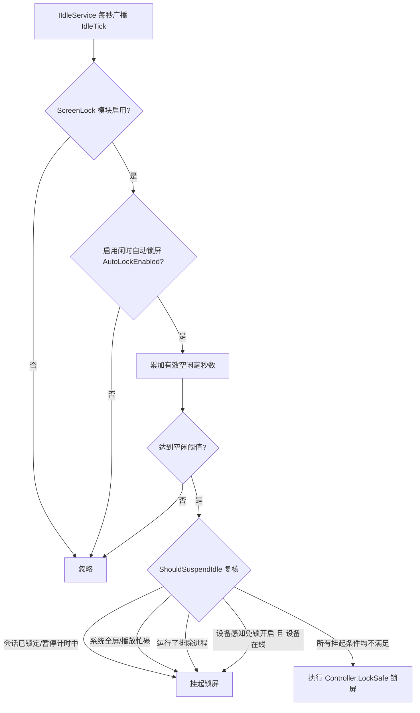
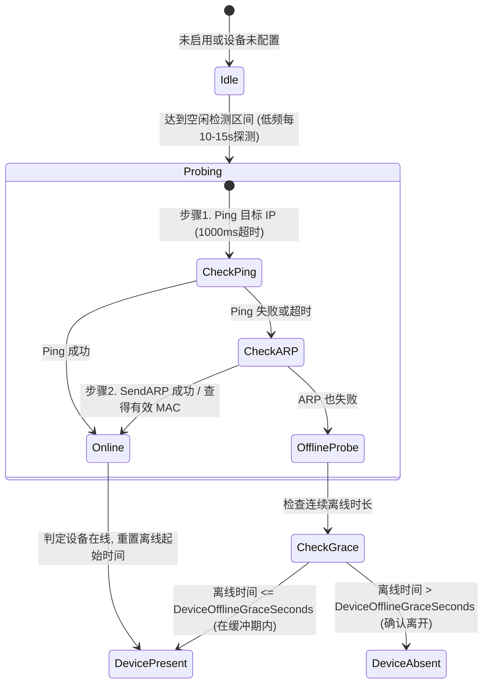

# 屏幕保护增强设计：暂停计时预设、自动锁屏开关与设备感知免锁

> 日期：2026-09-30  
> 模块：`ScreenLock` (屏幕锁定与闲时保护)  
> 适用框架：.NET Framework 4.8 / WPF / C# 7.3

---

## 1. 背景与目标

CarroDesk 当前的 `ScreenLock` 模块具备空闲锁屏、全屏伪锁屏、PIN 验证、全屏/视频排除以及排除进程挂起等能力。为了满足更精细的免扰办公与工位感知需求，本次进行三项核心功能增强：

1. **暂停计时预设扩充**：托盘菜单预设项由原先的 30 分钟、1 小时，扩充为 `[30分钟, 1小时, 2小时, 4小时, 8小时]`，方便长时间开会或挂机时灵活快速暂停。
2. **独立自动锁屏开关**：增加 `AutoLockEnabled` 配置开关，允许用户在托盘菜单与设置窗口一键开启/停用闲时自动锁屏，且不影响快捷键手动锁屏（如 `Ctrl+Alt+L`）与托盘立即锁屏。
3. **设备感知免锁屏（移植自 Carrot.AutoLock）**：
   - 针对“人携带手机/平板在工位附近时电脑即便闲置也不锁屏，离开后才自动锁屏”的需求；
   - 采用纯原生、轻量级、零 WinRT 依赖的局域网 IP 双重探测架构（ICMP Ping + ARP 链路层探测），在无需引入额外 SDK 包的前提下完美解决手机息屏休眠忽略 Ping 的难题，并辅以离线防抖缓冲。

---

## 2. 总体架构与时序设计

### 2.1 闲时状态机拦截判定流程



### 2.2 IP 设备探测状态机（双重探测与离线防抖）



---

## 3. 详细设计与数据契约

### 3.1 配置数据模型 (`ScreenLockConfig.cs`)

在 `ScreenLockConfig` 中增加以下配置项（采用向下兼容默认值）：

```csharp
/// <summary>
/// 是否启用闲时自动锁屏。为 false 时即使达到空闲时间也不会自动锁屏，但不影响热键锁屏。
/// </summary>
public bool AutoLockEnabled { get; set; } = true;

/// <summary>
/// 是否启用设备感知免锁屏（检测到指定 IP 在线时不自动锁定）。
/// </summary>
public bool DevicePresenceEnabled { get; set; } = false;

/// <summary>
/// 目标设备 IP 地址（例如用户的手机/平板在局域网中的静态或 DHCP 绑定 IP）。
/// </summary>
public string TargetDeviceIP { get; set; } = "";

/// <summary>
/// 离线防抖缓冲时间（秒，默认 30 秒）。
/// </summary>
public int DeviceOfflineGraceSeconds { get; set; } = 30;
```

### 3.2 IP 检测服务 (`IpPresenceDetector.cs`)

位于 `src/Modules/ScreenLock/Services/IpPresenceDetector.cs`：
- **P/Invoke 定义**：
  ```csharp
  [DllImport("iphlpapi.dll", ExactSpelling = true)]
  private static extern int SendARP(uint destIp, uint srcIp, byte[] pMacAddr, ref uint phyAddrLen);
  ```
- **核心探测逻辑**：
  1. 验证目标 IP 有效性（IPv4）；
  2. 优先执行异步 `Ping.SendPingAsync(targetIP, 1000)`；
  3. 若 Ping 失败（手机息屏休眠常见），降级调用 `SendARP` 发送链路层 ARP 请求；
  4. 具备结果缓存机制（例如 10 秒结果缓存），避免每秒 IdleTick 造成密集发包。

### 3.3 托盘菜单增强 (`ScreenLockModule.cs`)

1. **暂停计时预设**：
   - 数组驱动：`[30, 60, 120, 240, 480]`（对应 30分钟、1小时、2小时、4小时、8小时）；
   - 保留“恢复计时”与“自定义暂停分钟数...”（默认值改为 30 分钟）。
2. **自动锁定开关**：
   - 在“空闲锁定”二级菜单首项放置 `[x] 启用自动锁定`；
   - 点击直接切换 `Config.AutoLockEnabled` 并持久化，立即生效。

### 3.4 设置界面 (`ScreenLockSettingsWindow.xaml`)

1. 基础设置区域：
   - 增加 CheckBox `[x] 启用闲时自动锁定`，未勾选时禁用时长下拉框。
2. 设备感知免锁区域：
   - 增加分组或折叠卡片【设备感知免锁（近场免打扰）】；
   - 提供 `[x] 检测到指定设备 IP 在线时不自动锁屏`；
   - 提供目标 IP 输入框、离线缓冲秒数调节；
   - 提供【测试连接】按钮与异步状态文本反馈（在线 / 离线 / 格式错误）。

---

## 4. 健壮性与边界防护

1. **网络异常隔离**：网络波动、断网、DNS 解析异常等均由服务内部捕获并记录 Debug 日志，绝不抛出未处理异常击穿锁屏模块。
2. **配置合法性校验**：在保存设置时校验目标 IP 是否为合法 IPv4 地址，离线缓冲时间必须在合理区间（5-3600 秒）。
3. **低资源消耗保证**：
   - 仅在配置了合法 IP 且启用了功能时才启动探测；
   - 探测结果设置缓存周期，避免高频 I/O 与网络开销；
   - 键鼠活跃时完全不探测，仅在准备评估锁屏决策时才复核探测。
