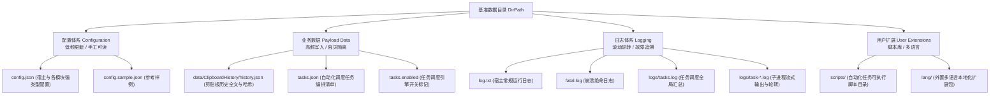

# CarroDesk 数据、配置与日志存储现状全景规范

> **文档创建日期**：2026-09-18  
> **文档版本**：v1.0  
> **状态**：现行基线（Current State Baseline）  
> **适用范围**：CarroDesk 宿主核心（Host）、全部业务模块（Modules）及底层服务

---

## 1. 概述与存储分层原则

CarroDesk 作为一个面向桌面运维与高效工作流的增强工具箱，其数据读写与磁盘存储严格遵循**“职责分明、动静分离、轻重解耦”**的分层治理原则：



---

## 2. 基准存储目录决议机制（Root Directory Resolution）

宿主在启动之初由 `CarroDesk.Services.ConfigService` 执行动态基准路径解析，提供**标准漫游模式**与**便携绿化模式**的无缝自适应切换：

```csharp
public static bool IsPortableMode => File.Exists(PortableFlagPath);
public static string DirPath => IsPortableMode ? PortableDataDirPath : AppDataDirPath;
```

| 部署模式 | 激活判定条件 | 基准目录绝对路径 (`DirPath`) | 典型适用场景 |
| :--- | :--- | :--- | :--- |
| **便携绿化模式**<br>(Portable) | 可执行文件同级目录下存在 `portable.ini` 标记文件 | `<exe所在目录>\app_data\` | U 盘移动办公、免安装绿色解压运行，数据全部内聚于本目录 |
| **标准漫游模式**<br>(Roaming) | 默认缺省（无 `portable.ini`） | `%APPDATA%\CarroDesk\`<br>(如 `C:\Users\<user>\AppData\Roaming\CarroDesk`) | Windows 标准安装版，配置与用户 Profile 自动绑定漫游 |

---

## 3. 全局存储拓扑全景（Topology Tree）

当所有功能全量运行时，`DirPath` 根目录下的标准目录树结构如下：

```text
<DirPath>/
├── config.json                     # [核心配置] 宿主通用配置及所有业务模块命名空间配置
├── config.sample.json              # [参考样例] 宿主首次启动自动补全的配置参考模板
├── config.corrupt-*.json           # [自愈容灾] JSON 语法损坏时自动重命名的备份副本
│
├── tasks.json                      # [任务清单] TaskScheduler 模块的核心任务编排定义
├── tasks.sample.json               # [任务样例] 任务调度的初始参考模板
├── tasks.enabled                   # [运行标记] 任务引擎全局开关轻量标记文件
├── tasks.corrupt-*.json            # [自愈容灾] 任务定义解析损坏时的故障副本
│
├── data/                           # [业务数据 Payload 根目录]
│   └── ClipboardHistory/           # 剪贴板历史模块专属业务数据目录
│       └── history.json            # 历史剪贴板条目（全文、预览、时间戳、MD5）
│
├── logs/                           # [任务进程日志目录]
│   ├── tasks.log                   # 任务调度触发、跳过、退出码汇总日志
│   ├── tasks.log.1 ~ .3            # 滚动轮转的历史备份文件（单文件上限 5MB）
│   ├── task-{TaskName}.log         # 各独立任务进程的 stdout/stderr 流式捕获明细
│   └── task-{TaskName}.log.1 ~ .3  # 独立任务日志的滚动备份
│
├── scripts/                        # [用户脚本库] 供 TaskScheduler 相对路径调用的脚本存放目录
├── lang/                           # [本地化扩展] 供用户外置投放的自定义 {lang}.json 语言包
│
├── log.txt                         # [宿主运行日志] 宿主与模块通过 ILoggerService 记录的常规日志
└── fatal.log                       # [致命崩溃日志] AppDomain/Dispatcher 绝命未捕获异常
```

---

## 4. 配置存储架构（Configuration Storage）

### 4.1 物理聚合与逻辑隔离设计

CarroDesk 对配置采用**“单文件物理收敛 + 模块强类型逻辑隔离”**的混合范式：
- **物理上**：统一落盘于单个 `config.json`，极大降低了用户手工管理、跨设备同步和配置备份的复杂度；
- **逻辑上**：通过 `IConfigManager`（`ConfigManager` 实现）提供类型安全沙箱，宿主与模块互相隔离：
  - 宿主 `AppSettings` 仅包含顶级基础设施键（`Language`, `AutoStart`, `FloatingPanel*`, `PinSalt`, `PinHash`）；
  - 各模块只知晓自身的强类型配置对象 `TConfig`，通过 `GetModuleConfig<TConfig>(Id)` 和 `SaveModuleConfig(Id, Config)` 自治读写；
  - 模块增删仅表现为 `config.json` 内的一段独立 JSON 节点，互不影响。

### 4.2 模块配置节点映射表

| 模块标识 (`Id`) | 配置强类型类 | 节点键名 | 核心配置项与默认值摘要 |
| :--- | :--- | :--- | :--- |
| **`ClipboardHistory`** | `ClipboardHistoryConfig` | `"ClipboardHistory"` | `Enabled: true`, `Hotkey: "Win+Alt+V"`, `MaxPreviewChars: 100`, `MaxItems: 1000`, `RetentionDays: 90` |
| **`TaskScheduler`** | `TaskSchedulerConfig` | `"TaskScheduler"` | `GlobalEnabled: true`, `TasksFile: "tasks.json"` |
| **`ScreenLock`** | `ScreenLockConfig` | `"ScreenLock"` | `Enabled: true`, `IdleMinutes: 5`, `ShowClock: true`, `OverlayOpacity: 0.88`, `UnlockOnResume: true`, `ExcludeProcesses: []` |
| **`MonitorProfile`** | `MonitorProfileConfig` | `"MonitorProfile"` | `Enabled: true`, `AutoSchedule: true`, `ActiveProfile: "Daily"`, `Profiles: { Daily, Game, Night }` |
| **`AppAutoMute`** | `AppAutoMuteConfig` | `"AppAutoMute"` | `Enabled: true`, `Hotkey: "Ctrl+Win+S"`, `MuteDelayMs: 1000`, `UnmuteDelayMs: 500`, `Mode: "Blacklist"`, `TargetApps: [...]` |
| **`AudioSwitch`** | `AudioSwitchConfig` | `"AudioSwitch"` | `Hotkey: "Win+Alt+A"`, `Cycle: "all"` |
| **`Awake`** | `AwakeConfig` | `"Awake"` | `KeepDisplayOn: true`, `Mode: "display"` |

### 4.3 写入安全：`AtomicFile` 原子替换机制

配置文件保存绝不直接覆盖原文件，而是通过 `CarroDesk.Common.AtomicFile.WriteAllText` 执行事务级替换：
1. **生成临时文件**：在同级目录下生成 `<filename>.tmp.<guid>`；
2. **完整落盘**：写入 UTF-8 内容并强制清空缓冲区（Flush）；
3. **原子交换**：
   - 优先通过 Win32 API 执行单步原子替换；
   - 若遇瞬时独占锁（如杀毒软件扫描），则自动降级执行安全重命名备份 `<filename>.bak.<guid>` 后覆盖并清理；
4. **防半写失效**：即使写入瞬间系统断电或进程被强杀，原文件依旧完整无损，绝不产生 0 字节损坏。

### 4.4 容灾自愈机制

当读取 `config.json` 或 `tasks.json` 发生不可逆的 JSON 语法破坏时：
- 系统绝不直接覆写冲掉损坏文件；
- 自动触发备份保护：将其安全重命名为 `config.corrupt-yyyyMMddHHmmss.json`；
- 生成全新默认配置保证应用可持续启动，并向托盘抛出异常提示。

---

## 5. 业务数据存储架构（Payload Data Storage）

### 5.1 数据与配置物理隔离红线

依据《模块开发指南》第 4.3 节架构硬性红线：**严禁将大容量、高频变动的业务记录写入 `config.json`**。

```text
[反模式] 剪贴板将 1000 条历史文本记录塞入 config.json
  ├── 导致：每次复制文本都要重写整个几十KB~几MB的主配置
  ├── 引发：宿主与其他模块配置保存竞争
  └── 风险：配置损坏率与内存占用成倍暴增

[标准范式] 物理路径彻底隔离
  ├── config.json                    -> 仅留存 RetentionDays、MaxItems、Hotkey
  └── data/ClipboardHistory/history.json -> 异步独占持久化历史文本实体
```

### 5.2 剪贴板历史模块（`ClipboardHistory`）

- **存储文件**：`DirPath/data/ClipboardHistory/history.json`
- **存储介质**：`CarroDesk.Modules.ClipboardHistory.Services.JsonClipboardHistoryStorage`
- **实体模型 (`ClipboardItem`)**：
  - `Id`: GUID 主键
  - `FullText`: 完整原始文本内容（无截断）
  - `PreviewText`: 列表展示文本（超过 100 字符自动追加 `...` 截断）
  - `CharCount`: 原文字符数统计
  - `Timestamp`: 捕获时刻（`DateTime`）
  - `Md5Hash`: 快速重复比对与 MRU 置顶哈希
- **生命周期策略**：
  - **超额淘汰**：条目数超过 `MaxItems`（默认 1000）自动剔除最旧项；
  - **过期淘汰**：超过 `RetentionDays`（默认 90 天）启动与录入时自动淘汰；
  - **异步写入**：采用后台非阻塞原子写入，不干扰主线程剪贴板监听。

### 5.3 任务调度模块（`TaskScheduler`）

- **存储文件**：`DirPath/tasks.json`
- **读写服务**：`TaskConfigService`
- **内容形态**：自动化任务定义数组（`TaskDefinition[]`），支持按计划（Cron/Daily/Interval）、快捷键、文件变动、系统空闲及进程启动等多维触发器；
- **伴生文件**：
  - `tasks.enabled`：单字节标记文件，供轻量快速判断引擎全局启闭；
  - `tasks.sample.json`：宿主首次引导生成的任务编排参考模板。

### 5.4 用户扩展资产库

- **脚本库 (`scripts/`)**：
  - 路径：`DirPath/scripts/`
  - 规则：用户放置在此的 `.bat`、`.ps1`、`.js`、`.py` 等脚本，在 `tasks.json` 中可直接通过相对路径（如 `"path": "cleanup.bat"`）被 `ScriptResolver` 快速定位解析，免去配置长绝对路径。
- **本地化字典 (`lang/`)**：
  - 路径：`DirPath/lang/`
  - 规则：支持高级用户放置外置扩展字典包（如 `ja-JP.json`），`I18nService` 会在初始化时自动加载并深度覆盖内建字典。

---

## 6. 日志存储架构（Log Storage）

CarroDesk 建立了三级完备的日志捕获机制：

```text
+-------------------+-----------------------------+----------------------------------------------+
| 日志类型           | 落盘物理路径                 | 捕获级别与滚动策略                            |
+-------------------+-----------------------------+----------------------------------------------+
| 宿主常规运行日志   | <DirPath>/log.txt           | INFO, WARN, ERROR。单文件追加，跨线程互斥锁   |
| 绝命致命崩溃日志   | <DirPath>/fatal.log         | FATAL。AppDomain/Dispatcher 未处理崩溃前急写   |
| 任务调度运行日志   | <DirPath>/logs/tasks.log    | 汇总任务生命周期。5MB 触发滚动（保留 3 代）    |
| 子进程标准输出日志 | <DirPath>/logs/task-*.log   | 区分 [OUT] 与 [ERR]。5MB 触发滚动（保留 3 代）|
+-------------------+-----------------------------+----------------------------------------------+
```

### 6.1 宿主运行日志 (`log.txt`)
- **写入服务**：`DefaultLoggerService`（实现 `ILoggerService`）；
- **标准格式**：`[yyyy-MM-dd HH:mm:ss.fff] [LEVEL] [MODULE] message`；
- **诊断通道**：同步通过 `System.Diagnostics.Debug.WriteLine` 投递至调试器输出窗口。

### 6.2 致命崩溃日志 (`fatal.log`)
- **触发源**：`App.xaml.cs` 中的 `OnDispatcherUnhandledException` 与 `OnAppDomainException`；
- **写入机制**：遇到严重不可恢复异常时，绕过常规服务容器直接同步裸写磁盘，随后调用 `Environment.FailFast` 终止进程，杜绝进程带毒僵死。

### 6.3 任务调度日志 (`logs/`)
- **实现类**：`CarroDesk.Services.Tasks.TaskLogger`；
- **分级双写**：
  1. 所有事件同步写入全局汇总文件 `logs/tasks.log`；
  2. 针对指定任务，将输出按行拆分，分别打上 `[OUT]` 或 `[ERR]` 前缀独立写入 `logs/task-{SanitizedName}.log`；
- **轮转算法 (`RotateIfNeeded`)**：
  - 当日志文件体积达到 **5MB (`MaxFileBytes`)** 时自动触发 3 代轮转；
  - 淘汰 `.3`，将 `.2` 移为 `.3`，`.1` 移为 `.2`，当前日志移为 `.1`，保证日志占用磁盘总体有界可控。

---

## 7. 总结与后续演进建议

当前 CarroDesk 的存储体系结构清晰，已完全实现：
1. **绿色便携与标准漫游环境统一决议**；
2. **配置单文件便携化与模块强类型沙箱逻辑隔离**；
3. **高频业务数据与配置的彻底物理隔离**；
4. **日志分级存储与大容量自动轮转保护**；
5. **基于 `AtomicFile` 的系统级断电与并发崩溃自愈保护**。

**后续可平滑演进点**：
- 若后续有需求将 `config.json` 物理上也拆分成 `config/modules/{ModuleName}.json`，只需重写 `ConfigManager` 的持久化适配器，无需改动任何模块核心代码。
